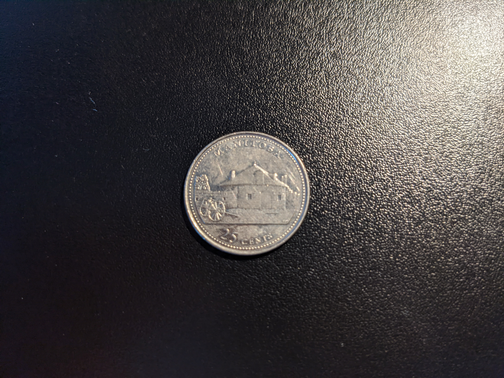
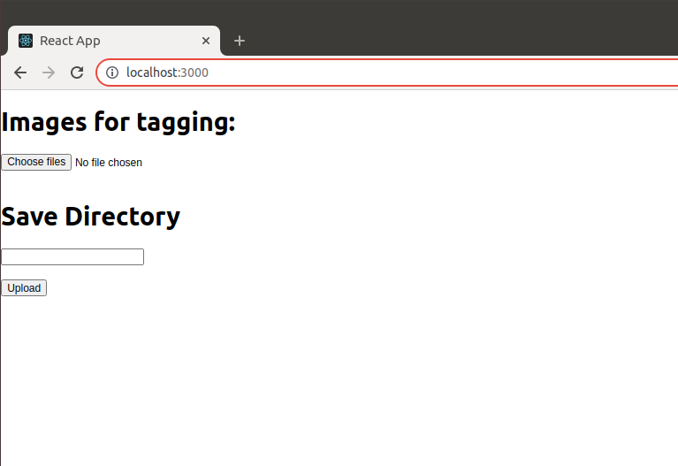
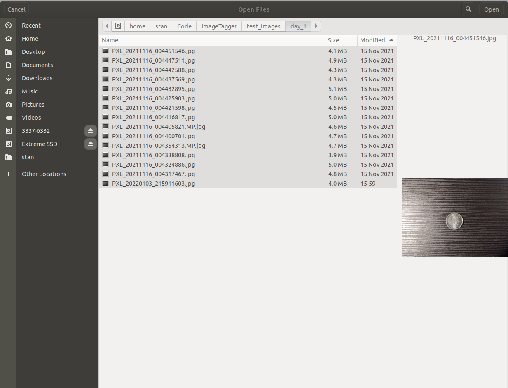
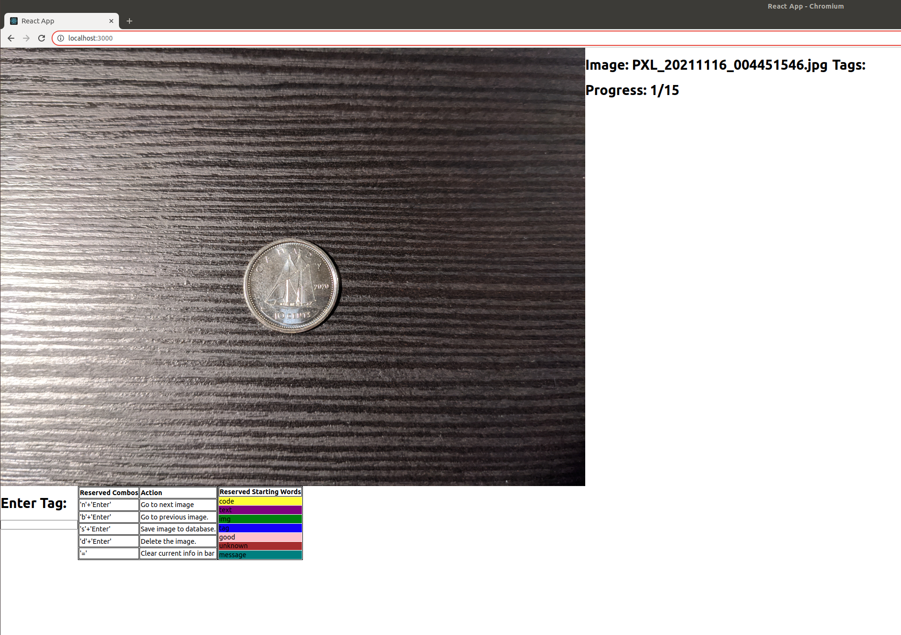
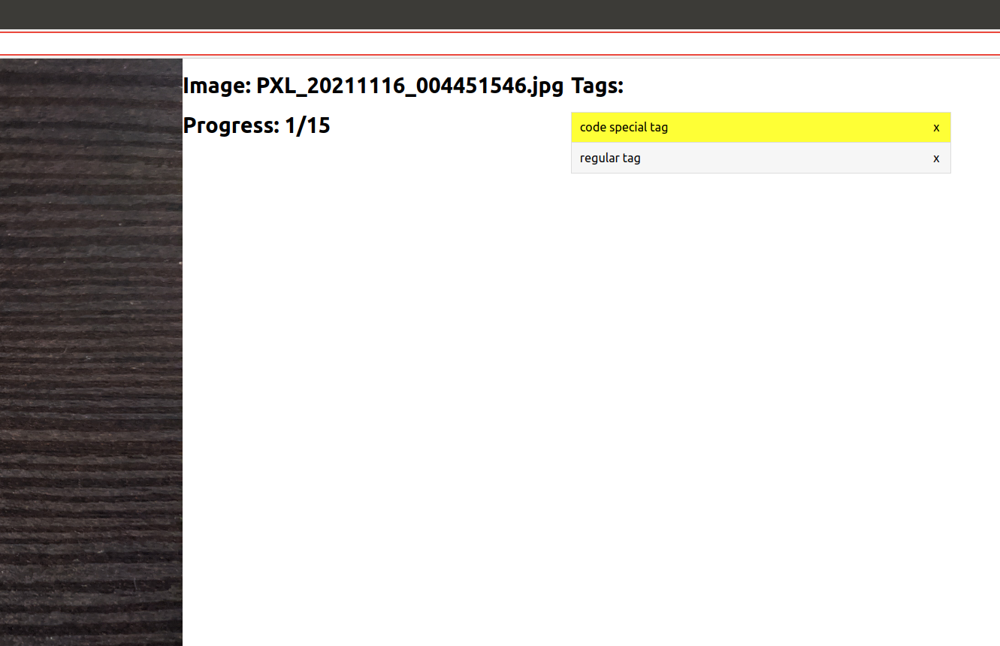
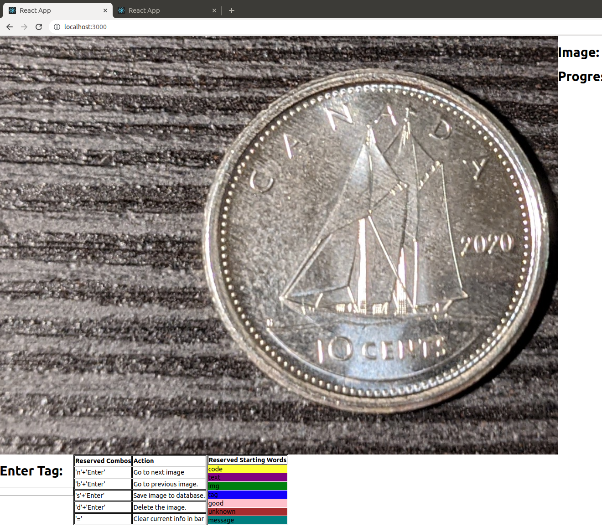
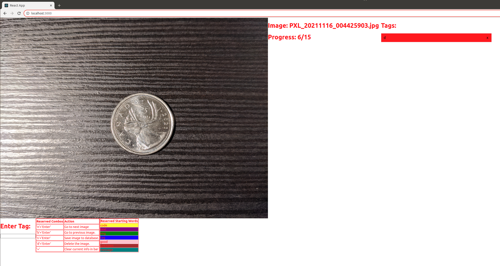
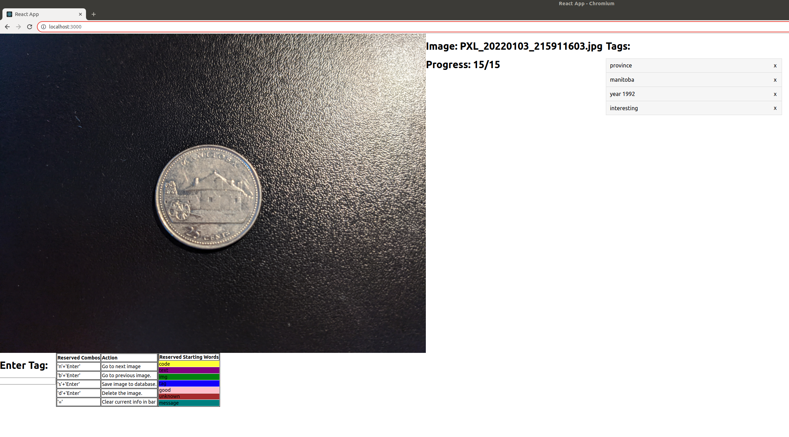
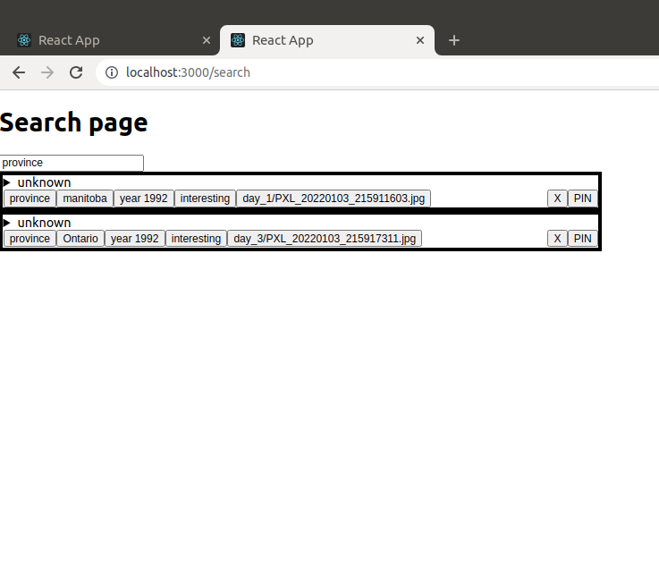
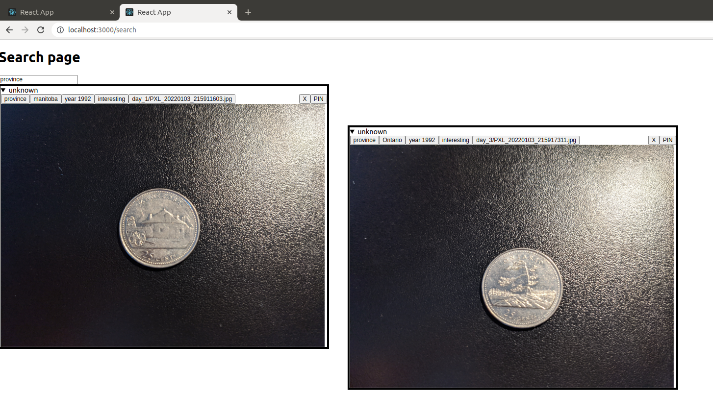

# ImageTagger

In this repository I implement a locally hosted in-browser tool built using React and Flask that helps sort pictures. Consider the following example scenario of coin collection as a motivation for the code in this repository.

### Scenario:

On a regular basis you are taking lots of high resolution pictures and need a way to sort them. The pictures all have a particular theme to them and you are looking to organize them and search through them as you collect more and more. In this repository we will pretend we are coin enthusiasts and every day we are taking a bunch of coin pictures of coins that we have found that day. These coins are in `test_images` directory with each day containing some sample pictures (`day_1`, `day_2` and `day_3`).

The coins have
 - A type (Loonie, Twonie, Quarter, Nickel, Dime)
 - The year of minting
 - Other interesting features like rust or scratches
 - Specials coin (e.g. a coin minted for celebrating some holiday)

Here is a sample image:


You may say this coin is
 - A Quarter
 - From 2021
 - Not interesting and should be deleted from your collection of pictures

With another coin:



You may say this coin is
 - A Quarter 
 - From year 1992 (year visible on back)
 - A coin about a Canadian `province` of `Manitoba`.
 - Very interesting. You want to keep the picture.

As you process your images, you want to tag these features for easier searching later on. The quarter above can be tagged with `year 1992`, `type quarter`, `province`, `img manitoba`. Tagging must be easy and ideally mouse free in order to avoid carpal tunnel especially if you are processing many pictures. In addition, to determine all of the qualities you may need to easily zoom in on the coin to add all appropriate tags.

Once you processed an image and decided you want to keep it you save it.

Say on `day_3` you find another quarter captured below:


You tag this image `year 1992`, `type quarter`, `province`, `ontario`. You recall that you already have encountered a `manitoba` coin before and want to search for it and view the coins side by side. You want to find all `province` coins to see how many province coins you have discovered. You search by `province` and see all the images loaded up.
 
### Solution:

To see how the scenario described above is handled by the code here, let's load up the app. To load the front end:

```
cd site
npm start
```

that runs in `http://localhost:3000`.

We must then specify where the images are stored for the backend which is done in `tag_store/store.py`:

```python
image_store = '/media/stan/Extreme SSD/coin_pictures'
```

In this case I am using a separate hard drive (with folder existing) for storing images in preparation for many picture of coins. To run the backend, in new terminal

```
cd tag_store
export FLASK_APP=tag.py
flask run
```

The backend runs in `http://127.0.0.1:5000/` which is specified in `site/src/App.js`.

We are now ready to load the front end in a web browser:



We select "Choose files" to load the images of coins we have captured that day.



For `Save Directory` input box we specify an identifier which in this case we can specify as `day_1`. Each day we will load new pictures from our camera (in this case simulated by the `test_images/day_N` folder) and specify a unique identifier in the `Save Directory` for which I prefer to use the date (`YYYY_MM_DD`).

Upon pressing `Upload` the images are uploaded to `image_store` in backend to folder `day_1`. After uploading is finished we are redirected to a new page



On the top right the app specifies the name of the current image viewed, the image's tags (in previous image we have not entered any yet) and how many images we have to tag.

On the bottom of the image we have a `Enter Tag` input field which the cursor is automatically on upon loading the page so we can start typing right away. The input field is modified for quick typing which is explained in the `Reserved Combos`/`Action` table. Most special about the commands is that saving and navigating across all the images can be done via keyboard. The `Reserved Starting Words` table specifies keywords that are 'special'. These special keywords are specified in `site/src/config.json` and only serve for colour coding as seen in image below:



We can zoom in on the coin using the mouse scroll to get more clarity if necessary.




The tags above are not coin related. Let's get back to initial example of the boring quarter. We press 'd' in the search bar followed by 'Enter' which marks the image as deleted.



For the Manitoba quarter we tag as such:



Later, on `day_3`, we see the Ontario code and tag it appropriately.

We can now search for the two coins in `http://localhost:3000/search` using the `province` key word (or `year 1992` or `interesting`...):



The elements can be expanded to view the images as well as move them around for a side by side comparison:




### Brief code overview

There are two components to the code. The first component is the backend and the second is the front end.

#### Frontend

Code located in `site/src`.

 - `App.js` defines two routes for searching and tagging
   - (searching) `Search.js` is for handling the logic in `http://localhost:3000/search`
     - `ImageComponent.js` is used by `Search.js` for displaying the searched for objects
   - (tagging) `Tag.js`
     - `Upload.js` used to upload the images before main tagging UI/logic is displayed
   - `windows.js` for defining browser dimensions

#### Backend

Code located in `tag_store`. The various routes are handled in `tag_store/tag.py` with first half for tagging/storing operations and second half for searching operations. `tag_store/store.py` contains logic for loading up and storing data and is a wrapper (perhaps can be replaced by a database). `tag_store/search.py` contains logic to assist in searching.
